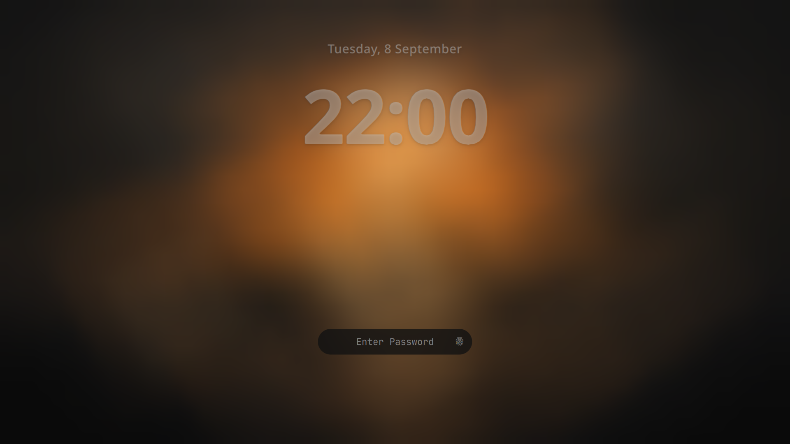
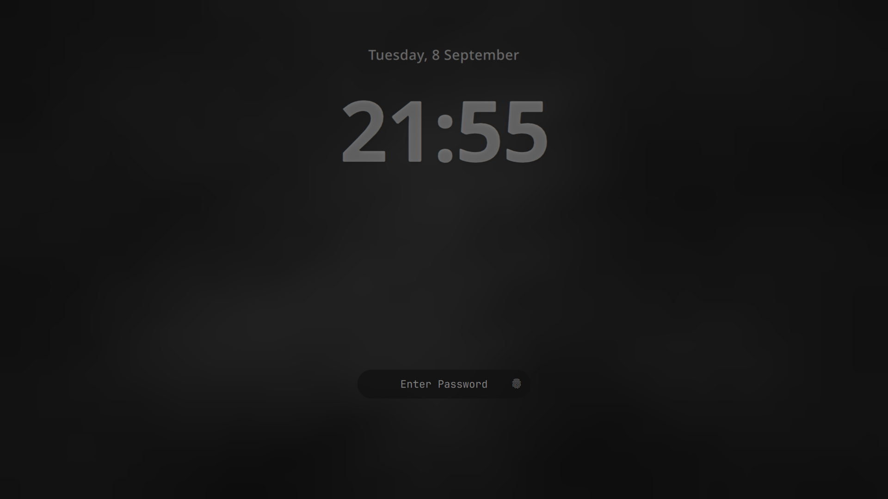

# Tahoe Lock Screen

An [Omarchy](https://omarchy.org/) lock screen with a macOS Tahoe style clock:
a large date and time set in the upper third of the screen, and a small
rounded password pill below center.

It is the stock Omarchy lock screen with a new face. The PAM flows — password,
fingerprint, the stranded-lock recovery — are unchanged from upstream, so
unlocking behaves exactly as it does out of the box.





Both shots are the same plugin on the stock `matte-black` theme — only the
background differs. The clock takes its color from the theme, so how much it
stands out is a property of the wallpaper behind it. Raise `opacity` if you
want it to carry further on a dark one.

## Requirements

- Omarchy 4.x, which ships the Quickshell-based `omarchy-shell` lock screen.
  Check with `omarchy version`. Earlier releases used hyprlock and this plugin
  will not load on them.
- The `Noto Sans` font (`pacman -S noto-fonts`), or set `fontFamily` to a
  family you already have.

## Install

On a fresh machine, from a terminal:

```bash
omarchy plugin add https://github.com/Mudales/omarchy-tahoe-lock --enable
omarchy restart shell
```

`omarchy plugin add` clones the repo into
`~/.config/omarchy/plugins/tahoe.lock/`, validates the manifest, and asks you
to confirm — plugins run unsandboxed inside your shell process, so read the
code first. `--enable` then switches the built-in `omarchy.lock` off and this
one on; the restart is what makes the new lock screen take effect, because Qt
caches the compiled QML.

Confirm it took, without locking yourself out:

```bash
omarchy-shell lock preview      # show the new lock screen
omarchy-shell lock hidePreview  # dismiss it
```

If the preview still shows the stock centered password box, the shell has not
picked the plugin up. Check that it is enabled:

```bash
omarchy plugin list | grep lock
```

`tahoe.lock` should read `enabled`, and `omarchy.lock` should read `disabled`.

## Uninstall

Back to the stock Omarchy lock screen:

```bash
omarchy plugin remove tahoe.lock
omarchy plugin enable omarchy.lock
omarchy restart shell
```

The first command deletes `~/.config/omarchy/plugins/tahoe.lock/`; the second
restores the built-in that installing had switched off. Removing the plugin
without re-enabling `omarchy.lock` leaves you with no lock screen service, so
run both.

Any settings you added under this plugin's `shell.json` entry are removed with
it. Nothing else in your config is touched.

## Configuration

Every dimension is a fraction of screen height, so the layout holds its
proportions on any monitor. Override any of it from this plugin's entry in
`~/.config/omarchy/shell.json`:

```json
{
  "plugins": [
    {
      "id": "tahoe.lock",
      "timeFormat": "h:mm AP",
      "weight": "light",
      "opacity": 0.7
    }
  ]
}
```

| Key                | Default        | What it does                                                                  |
| ------------------ | -------------- | ----------------------------------------------------------------------------- |
| `timeFormat`       | `HH:mm`        | Qt date format for the time. `h:mm AP` gives 12-hour.                         |
| `dateFormat`       | `dddd, d MMMM` | Qt date format for the line above the time.                                   |
| `fontFamily`       | `Noto Sans`    | Clock typeface. Any installed family.                                         |
| `weight`           | `bold`         | Time weight: `thin`…`light`, `normal`, `medium`, `demibold`, `bold`, `black`. |
| `dateWeight`       | `demibold`     | Same vocabulary, for the date line.                                           |
| `opacity`          | `0.55`         | How far the clock is held back from the theme's foreground color.             |
| `timeScale`        | `0.17`         | Time size as a fraction of screen height.                                     |
| `dateScale`        | `0.16`         | Date size as a fraction of the time size.                                     |
| `topScale`         | `0.09`         | Gap above the clock, as a fraction of screen height.                          |
| `fieldWidth`       | `300`          | Password pill width, in pixels.                                               |
| `fieldHeight`      | `50`           | Password pill height, in pixels. The corner radius is always half of this.    |
| `fieldOffsetScale` | `0.27`         | How far below center the pill sits, as a fraction of screen height.           |
| `fieldBorder`      | `false`        | Put the theme's accent ring back on the resting pill.                         |

Colors come from the active theme's `[lock]` section, so the clock follows
whatever theme is set rather than pinning itself to white.

Settings are read when the shell starts and on a plugin rescan, so
`omarchy restart shell` after editing `shell.json`. The same applies with more
force to the plugin's own `.qml` files: Qt caches the compiled QML, and a hot
reload will report success without changing what is drawn.

## Credits

Derived from the `omarchy.lock` plugin in
[Omarchy](https://github.com/basecamp/omarchy), MIT licensed. `Service.qml` is
upstream's, unmodified apart from the settings plumbing; `LockView.qml` is the
reskinned view.
